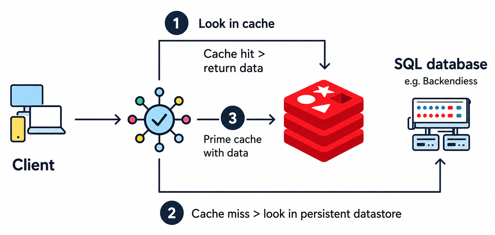
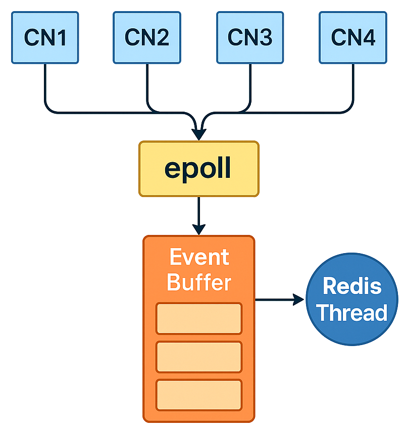

# Redis Lab

A beginner-friendly, step-by-step guide to learning Redis — from installation and basic commands to replication, scripting, and client integration.

## Redis

Redis (Remote Dictionary Server) is an open-source, in-memory data store that supports key-value data structures like strings, lists, sets, hashes, and sorted sets. Unlike traditional databases, Redis stores data in RAM, enabling ultra-fast read and write operations with low latency. It is widely used for caching, session management, real-time analytics, and pub/sub messaging in distributed systems.

The diagram above illustrates the most common Redis use case: **caching in front of a database**. When a client requests data, the application first checks Redis (step 1). If the data is found (a cache hit), it is returned immediately from memory — no database query needed. If the data is not in the cache (a cache miss), the application fetches it from the persistent SQL database (step 2), returns it to the client, and stores a copy in Redis (step 3) so that subsequent requests for the same data are served instantly from the cache.

### How Redis Works (Architecture)

Redis achieves exceptional speed through two design choices: storing all data in RAM and processing commands in a single thread. Understanding these internals helps explain both Redis's strengths and its limitations.

#### In-Memory Storage

Traditional databases read and write data to disk (HDD/SSD), which introduces I/O latency. Redis keeps the entire dataset in RAM, where access times are measured in nanoseconds rather than milliseconds. This is why basic operations like `GET`, `SET`, and `INCR` complete in microseconds.

The tradeoff is that data is volatile — if Redis crashes, anything not persisted to disk is lost. Redis addresses this with persistence mechanisms (RDB and AOF), covered in [Persistence](docs/06_redis_persistence.md).

#### Single-Threaded Event Loop

Redis uses a single thread to process all client commands sequentially. At first this seems like a bottleneck, but it eliminates the overhead of thread synchronization (locks, context switches) and keeps the code simple and predictable. Since each operation runs on in-memory data structures, individual commands complete in microseconds — fast enough that one thread can handle hundreds of thousands of operations per second.

#### I/O Multiplexing (How One Thread Serves Many Clients)

If Redis is single-threaded, how does it handle thousands of concurrent connections? The answer is **I/O multiplexing** using system calls like `epoll` (Linux) or `kqueue` (macOS).

Instead of dedicating a thread to each client connection, Redis registers all connections with the OS and asks: "notify me when any of these connections have data ready to read." The OS watches all connections efficiently in the background and wakes Redis only when there's actual work to do.

The diagram above shows this in action. CN1–CN4 represent client connections. The OS (`epoll`) monitors all connections and notifies Redis when any client has data ready. Those commands are queued in an event buffer, and the Redis thread processes them one at a time.

The flow works like this:

1. Clients connect to Redis (thousands can be connected simultaneously).
2. The OS monitors all connections and notifies Redis when a client sends a command.
3. Redis reads the ready commands and adds them to an internal queue.
4. The event loop processes commands one at a time, executes them against in-memory data, and sends responses back.

**Analogy — The Restaurant:** Imagine a restaurant with one extremely fast chef (Redis thread). A waiter (epoll) watches all tables and tells the chef only when a table has placed an order. The chef processes orders one at a time from a ticket queue, but since each dish is prepared almost instantly (in-memory operations), hundreds of tables are served with barely any wait.

#### Tradeoffs and Scaling

The single-threaded design means one slow command (e.g., `KEYS *` on a large database) blocks all other clients until it finishes. Redis mitigates this at scale through:

- **Multiple instances** — Run separate Redis servers on different ports to utilize more CPU cores (covered in [Multiple Redis Instances](docs/01_redis.md#multiple-redis-instances)).
- **Pipelining** — Batch multiple commands in one network round-trip to reduce latency (covered in [Python Client](docs/13_redis_client_python.md#pipelines)).
- **Read replicas** — Offload read traffic to replica servers (covered in [Replication](docs/11_redis_replication.md)).
- **Redis Cluster** — Shard data across multiple nodes for horizontal scaling (covered in [Replication](docs/11_redis_replication.md#redis-cluster-horizontal-scaling)).

## Documentation

| #  | Topic                                                         | Description                                                        |
|----|---------------------------------------------------------------|--------------------------------------------------------------------|
| 01 | [Getting Started](docs/01_redis.md)                           | Installation, redis-cli, logical databases, and multiple instances |
| 02 | [Data Types](docs/02_redis_data_types.md)                     | Strings, lists, sets, sorted sets, hashes, streams, and more       |
| 03 | [Key Expiration & TTL](docs/03_redis_key_ttl.md)              | Setting timeouts on keys and checking remaining TTL                |
| 04 | [Key Scanning & Listing](docs/04_redis_key_search.md)         | Finding keys with KEYS, SCAN, and pattern matching                 |
| 05 | [Key Management Commands](docs/05_redis_key_commands.md)      | OBJECT, RENAME, MOVE, FLUSHDB, and other key operations            |
| 06 | [Persistence & Data Storage](docs/06_redis_persistence.md)    | RDB snapshots, AOF logging, and hybrid persistence                 |
| 07 | [Publish/Subscribe](docs/07_redis_pub_sub.md)                 | Real-time messaging with channels and pattern subscriptions        |
| 08 | [Pipelining](docs/08_redis_pipelining.md)                     | Batching commands to reduce network round-trips                    |
| 09 | [Transactions](docs/09_redis_transaction.md)                  | MULTI/EXEC, DISCARD, and optimistic locking with WATCH             |
| 10 | [Lua Scripting](docs/10_redis_lua.md)                         | Server-side scripting with EVAL, EVALSHA, and error handling       |
| 11 | [Monitoring & GUI](docs/11_redis_monitor.md)                  | MONITOR, MEMORY, SLOWLOG, LATENCY, and GUI tools                   |
| 12 | [Replication & Clustering](docs/12_redis_replication.md)      | Master-replica setup, Sentinel, and Redis Cluster                  |
| 13 | [Client Libraries](docs/13_redis_client_libs.md)              | Overview of Redis clients for various programming languages        |
| 14 | [Python Client](docs/14_redis_client_python.md)               | Using redis-py: data types, pipelines, transactions, WATCH         |
