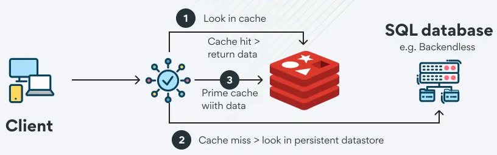

## Redis

Redis (Remote Dictionary Server) is an open-source, in-memory data store.

It supports key-value data structures like strings, lists, sets, hashes, and sorted sets.

Unlike traditional databases, Redis stores data in RAM, enabling ultra-fast read and write operations with low latency.

It is widely used for caching, session management, real-time analytics, and pub/sub messaging in distributed systems.

## Installing Redis

On Ubuntu/Debian:

    $ sudo apt update
    $ sudo apt install redis-server

Make sure the redis service is up and running:

    $ sudo systemctl status redis

    ● redis-server.service - Advanced key-value store
        Loaded: loaded (/lib/systemd/system/redis-server.service; enabled; vendor preset: enabled)
        Active: active (running) since Sun 2025-02-16 07:23:47 PST; 26s ago
        Docs: http://redis.io/documentation,
                man:redis-server(1)
        Main PID: 102180 (redis-server)
        Tasks: 4 (limit: 11658)
        Memory: 1.9M
        CGroup: /system.slice/redis-server.service
                └─102180 /usr/bin/redis-server 127.0.0.1:6379

To stop Redis service:

    $ sudo systemctl stop redis

To start Redis service:

    $ sudo systemctl start redis

If you don't want to install Redis manually, you can use Docker:

    $ docker run --name redis-container -d -p 6379:6379 redis

To connect from a Redis CLI:

    $ docker exec -it redis-container redis-cli

## redis-cli

`redis-cli` is the command-line interface for interacting with a Redis server.

It allows users to execute Redis commands, manage data, monitor performance, and troubleshoot issues directly from the terminal.

It supports both interactive mode (where you enter commands manually) and non-interactive mode (executing commands via scripts).

By default, it connects to a Redis server running on `localhost:6379`, but you can specify different hosts and ports as needed.

To check if Redis is running:

    $ redis-cli ping

To get Redis server info:

    $ redis-cli info

When no command is given, redis-cli starts in interactive mode:

    $ redis-cli
    127.0.0.1:6379>

To return a list of all available commands in Redis along with their arity (number of arguments), flags, and other details:

    > COMMAND

For example,

    79) 1) "lpop"
        2) (integer) 2
        3) 1) write
           2) fast
        4) (integer) 1
        5) (integer) 1
        6) (integer) 1

Which is interpreted as:

- `1)` Command name: The command is LPOP (removes and returns the first element from a list).
- `2)` Arity: The command takes 2 arguments (including the command name itself).
- `3)` Command flags: 
    - "write" → The command modifies data (writes to Redis).
    - "fast" → The command executes quickly (O(1) operation).
- `4)` First key position: The first argument (key) is at position 1.
- `5)` Last key position: The last key argument is also at position 1.
- `6)` Step count: The command processes one key at a time.

## Redis Databases

Redis supports multiple logical databases, which are indexed numerically starting from 0 (default) up to a configurable limit.

The default is 16, but this can be changed via the databases setting in `redis.conf`.

You can check the number of configured databases using:

    $ redis-cli CONFIG GET databases

This will return:

    1) "databases"
    2) "16"

To switch to a different Redis database, use the `SELECT <index>` command:

    $ redis-cli
    > SELECT 2

Note that this selection is per connection and does not persist across reconnections.

To check the size of each database (number of keys), you can iterate through them:

    $ redis-cli

    > SELECT 0
    > DBSIZE

    > SELECT 1
    > DBSIZE

    ...

Each database is independent, meaning keys in one database do not interfere with keys in another.

In `SONiC` (Software for Open Networking in the Cloud), Redis is used as a central database to store and manage network state, configurations, and counters.

SONiC leverages multiple Redis databases to logically separate different types of data, ensuring efficient access and management. 

| DB Num | DB Name              | Description                                                                                                                |
|--------|----------------------|----------------------------------------------------------------------------------------------------------------------------|
| 0      | `APPL_DB`            | Stores application-specific data, including latest configuration states applied by control plane processes.                |
| 1      | `ASIC_DB`            | Maintains data related to the **ASIC (Application-Specific Integrated Circuit)**, used by SONiC's SAI to program hardware. |
| 2      | `COUNTERS_DB`        | Contains interface counters and statistics collected from the switch.                                                      |
| 3      | `LOGLEVEL_DB`        | Stores log level configurations for different services running in SONiC.                                                   |
| 4      | `CONFIG_DB`          | Holds SONiC's configuration data, including switch settings, VLANs, interfaces, and routing configurations.                |
| 5      | `PFC_WD_DB`          | Stores information related to **PFC (Priority Flow Control) watchdog** for managing network congestion.                    |
| 5      | `FLEX_COUNTER_DB`    | Shares the same database ID as `PFC_WD_DB` and is used for flexible counter processing.                                    |
| 6      | `STATE_DB`           | Contains the current operational state of SONiC services and components.                                                   |
| 7      | `SNMP_OVERLAY_DB`    | Stores SNMP-related data used by network monitoring tools.                                                                 |
| 8      | `RESTAPI_DB`         | Used by REST API services to store relevant operational and configuration data.                                            |
| 9      | `GB_ASIC_DB`         | Similar to `ASIC_DB`, but dedicated to a **Gearbox ASIC** in multi-ASIC systems.                                           |
| 10     | `GB_COUNTERS_DB`     | Stores counter statistics for the Gearbox ASIC.                                                                            |
| 11     | `GB_FLEX_COUNTER_DB` | Stores flexible counter data for Gearbox ASIC.                                                                             |
| 14     | `APPL_STATE_DB`      | Stores application state data for SONiC services.                                                                          |

Redis Cluster mode does not support multiple databases, as it is designed for distributed key management.

Instead of using multiple databases, best practices recommend using key prefixes (e.g., `app1:`, `user123:`) for logical separation.
