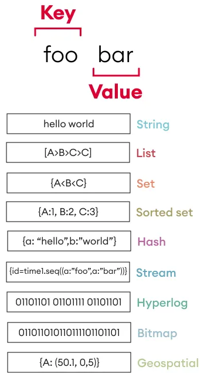

# Redis Data Types

## Key-Value Store

Redis is an in-memory key-value store that allows fast data access by associating unique keys with various types of values. Using `redis-cli`, you can set and get key-value pairs. Run the following command in your terminal to open an interactive Redis session:

    $ redis-cli

By default, `redis-cli` connects to `localhost:6379` and selects **database 0**. All commands in this document operate on database 0 unless stated otherwise. To use a different database, see the `SELECT` command in [Getting Started](01_redis.md#redis-databases).

Create a key named "mykey" with the value "Alice":

    > SET mykey Alice

Retrieve the value of "mykey":

    > GET mykey

In Redis, keys are case-sensitive — `mykey`, `Mykey`, and `myKey` are three distinct keys.

    > GET myKey
    (nil)

Key management commands:

| Command  | Description                              | Example        |
|----------|------------------------------------------|----------------|
| `EXISTS` | Checks if a key exists.                  | `EXISTS mykey` |
| `TYPE`   | Returns the data type of a key's value.  | `TYPE mykey`   |
| `DEL`    | Deletes a key and its value.             | `DEL name`     |

Examples:

    > EXISTS mykey   # Returns 1 if the key exists, 0 otherwise
    > TYPE mykey     # Returns "string" (the type of the value)
    > DEL mykey      # Returns 1 if the key was deleted, 0 if it did not exist

## Redis Keys Are Strings

In Redis, keys are always strings. Even when you supply a numeric literal, Redis stores it as its string representation:

    > SET 1 "alice"

Although `1` looks like an integer, Redis stores the key as the string `"1"`. You can confirm this because `GET 1` and `GET "1"` return the same result:

    > GET 1
    "alice"
    > GET "1"
    "alice"

Note: The `TYPE` command returns the data type of the *value* stored at a key, not the type of the key itself. All keys are strings regardless of what `TYPE` reports.

## Data Types Overview

Redis supports several value data types, each optimized for different use cases:

| Data Type             | Description                                                                     |
|-----------------------|---------------------------------------------------------------------------------|
| **String**            | A simple key-value pair, where the value is a binary-safe string (up to 512MB). |
| **List**              | An ordered collection of strings. Acts like a linked list.                      |
| **Set**               | An unordered collection of unique strings.                                      |
| **Sorted Set (Zset)** | A collection of unique strings with an associated score, sorted by score.       |
| **Hash**              | A key-value store within a key (similar to a dictionary).                       |
| **Stream**            | A log-based data structure for message queues and event processing.             |

Each type is designed for high performance and scalability, making Redis a versatile in-memory data store.

## String

Despite the name, a Redis String is not limited to text. It is a binary-safe byte sequence (up to 512 MB) that can hold text, integers, floats, JSON, or any arbitrary binary data. Redis automatically selects an efficient internal encoding based on the content (`int` for integer values, `embstr` for short strings up to 44 bytes, `raw` for everything else). Common use cases include caching, counters, session tokens, and simple key-value storage.

Basic String Commands:

| Command               | Description                                   | Example                  |
|-----------------------|-----------------------------------------------|--------------------------|
| `SET key value`       | Store a key with a value                      | `SET name "Alice"`       |
| `GET key`             | Retrieve the value of a key                   | `GET name`               |
| `APPEND key value`    | Append a value to an existing key             | `APPEND name " Johnson"` |
| `STRLEN key`          | Get the length of the value stored in a key   | `STRLEN name`            |

The `SET` and `GET` commands introduced in the [Key-Value Store](#key-value-store) section are the primary string operations. Calling `SET` on an existing key overwrites its value:

    > SET mykey "Hello, Redis!"
    > SET mykey "Updated Value"
    > GET mykey             # Output: "Updated Value"

You can append data to an existing key:

    > SET message "Hello"
    > APPEND message ", World!"
    > GET message   # Output: "Hello, World!"

Redis strings can store JSON as well:

    > SET user '{"name": "Alice", "age": 30}'
    > GET user

Numeric Operations:

| Command        | Description                      | Example            |
|----------------|----------------------------------|--------------------|
| `INCR key`     | Increment a numeric key's value  | `INCR counter`     |
| `DECR key`     | Decrement a numeric key's value  | `DECR counter`     |
| `INCRBY key n` | Increment by a specific value    | `INCRBY counter 5` |
| `DECRBY key n` | Decrement by a specific value    | `DECRBY counter 2` |

When a string value contains a valid integer, Redis supports atomic increment and decrement operations:

    > SET counter 0

Incrementing by 1 (INCR):

    > INCR counter
    > GET counter  # Output: 1

Incrementing by a specific value (INCRBY):

    > INCRBY counter 5
    > GET counter  # Output: 6

Decrementing by 1 (DECR):

    > DECR counter
    > GET counter  # Output: 5

## List

Redis List is an ordered collection of strings, similar to a linked list. It supports pushing, popping, trimming, and range queries, making it ideal for queues, stacks, and messaging applications.

List Commands:

| Command                 | Description                                    | Example                       |
|-------------------------|------------------------------------------------|-------------------------------|
| `LPUSH key value`       | Add value(s) to the left of the list           | `LPUSH tasks "task1"`         |
| `RPUSH key value`       | Add value(s) to the right of the list          | `RPUSH tasks "task2"`         |
| `LRANGE key start stop` | Get elements from a list                       | `LRANGE tasks 0 -1`           |
| `LLEN key`              | Get the length of a list                       | `LLEN tasks`                  |
| `LPOP key`              | Remove and get the first element               | `LPOP tasks`                  |
| `RPOP key`              | Remove and get the last element                | `RPOP tasks`                  |
| `BLPOP key timeout`     | Remove and get the first element (blocking)    | `BLPOP tasks 5` (waits 5 sec) |
| `BRPOP key timeout`     | Remove and get the last element (blocking)     | `BRPOP tasks 5` (waits 5 sec) |
| `LREM key count value`  | Remove elements matching value from the list   | `LREM tasks 2 "task1"`        |
| `LINDEX key index`      | Get an element at a specific index             | `LINDEX tasks 1`              |
| `LSET key index value`  | Set the value of an element at a given index   | `LSET tasks 1 "updated_task"` |
| `LTRIM key start stop`  | Trim the list to keep only a range of elements | `LTRIM tasks 1 3`             |

Adding elements to the left (LPUSH):

    > LPUSH mylist "A"
    > LPUSH mylist "B"
    > LPUSH mylist "C"
    > LRANGE mylist 0 -1    # ["C", "B", "A"]

Adding elements to the right (RPUSH):

    > RPUSH mylist "D"
    > LRANGE mylist 0 -1    # ["C", "B", "A", "D"]

Getting a subset of elements (LRANGE):

    > LRANGE mylist 0 1     # First 2 elements only

Getting the length of a list (LLEN):

    > LLEN mylist    # 4

Removing and returning the first element (LPOP):

    > LPOP mylist    # "C"

Removing and returning the last element (RPOP):

    > RPOP mylist    # "D"

Blocking pop operations:

- BLPOP and BRPOP are blocking pop commands.
- If the list is empty, Redis waits (blocks) until an element is available or timeout expires.
- Useful for message queues where workers wait for new tasks.

Removing specific elements (LREM):

    > DEL tasks
    > RPUSH tasks "a" "b" "a" "c" "a"   # [a, b, a, c, a]
    > LREM tasks 2 "a"                  # Removes the first 2 occurrences of "a"
    > LRANGE tasks 0 -1                 # [b, c, a]

Getting an element by index (LINDEX):

    > LINDEX tasks 1  # "c"

Setting an element by index (LSET):

    > LSET tasks 1 "x"         # Replaces index 1 ("c") with "x"
    > LRANGE tasks 0 -1        # [b, x, a]

Trimming a list (LTRIM):

    > LTRIM tasks 0 1          # Keeps only indices 0 through 1
    > LRANGE tasks 0 -1        # [b, x]

## Set

Redis Set is an unordered collection of unique strings. Unlike lists, sets do not allow duplicate values, making them ideal for removing duplicates, tracking unique items, and performing set operations (union, intersection, difference).

Set Commands:

| Command                   | Description                                | Example                             |
|---------------------------|--------------------------------------------|-------------------------------------|
| `SADD key value`          | Add value(s) to a set                      | `SADD fruits "apple" "banana"`      |
| `SMEMBERS key`            | Get all members of a set                   | `SMEMBERS fruits`                   |
| `SISMEMBER key value`     | Check if a value exists in a set           | `SISMEMBER fruits "apple"`          |
| `SCARD key`               | Get the number of elements in a set        | `SCARD fruits`                      |
| `SREM key value`          | Remove a value from a set                  | `SREM fruits "banana"`              |
| `SUNION key1 key2`        | Get the `union` of multiple sets           | `SUNION fruits vegetables`          |
| `SINTER key1 key2`        | Get the `intersection` of multiple sets    | `SINTER fruits berries`             |
| `SDIFF key1 key2`         | Get the `difference` between multiple sets | `SDIFF fruits tropical_fruits`      |
| `SPOP key`                | Remove and return a random element         | `SPOP fruits`                       |
| `SRANDMEMBER key`         | Get a random element without removing it   | `SRANDMEMBER fruits`                |
| `SMOVE source dest value` | Move an element from one set to another    | `SMOVE fruits tropical "banana"`    |

Adding elements to a Set (SADD):

    > SADD myset "apple"
    > SADD myset "banana"
    > SADD myset "cherry"
    > SADD myset "banana"  # Duplicate, won't be added

Retrieving all elements from a Set (SMEMBERS):

    > SMEMBERS myset

Checking if an element exists (SISMEMBER):

    > SISMEMBER myset "banana"

Getting the number of elements in a Set (SCARD):

    > SCARD myset

Removing an element from a Set (SREM):

    > SREM myset "banana"

Getting the union of sets (SUNION):

    > SADD set1 "apple" "banana" "cherry"
    > SADD set2 "cherry" "date" "elderberry"
    > SUNION set1 set2

Getting the intersection of sets (SINTER):

    > SINTER set1 set2

Getting the difference of sets (SDIFF):

    > SDIFF set1 set2

Removing and returning a random element (SPOP):

    > SPOP myset

Getting a random element without removing it (SRANDMEMBER):

    > SRANDMEMBER myset

Moving an element between sets (SMOVE):

    > SMOVE set1 set2 "banana"

## Sorted Set (Zset)

A Sorted Set (ZSET) in Redis is similar to a regular Set, but each element is associated with a score, which determines its sorted order. This makes ZSETs perfect for use cases like leaderboards, ranking systems, and time-series data.

While score is explicitly assigned and used for sorting, rank is dynamically calculated based on the scores of other elements.

- `score` is a numerical value associated with each member, used to determine its position in the set.
- `rank` is the zero-based index representing the member's position when sorted in ascending order of scores.

For example, if a leaderboard has:

- "Alice" (100 points)
- "Bob" (200 points)
- "Charlie" (150 points)

"Bob" has the highest score (200) but a rank of 2 (zero-based).

"Alice", despite being the lowest scorer, has a rank of 0.

Sorted Set Commands:

| Command                                  | Description                                     | Example                                 |
|------------------------------------------|-------------------------------------------------|-----------------------------------------|
| `ZADD key score value`                   | Add a value with a score to a sorted set        | `ZADD leaderboard 100 "player1"`        |
| `ZCARD key`                              | Get the number of elements in a sorted set      | `ZCARD leaderboard`                     |
| `ZSCORE key value`                       | Get the score of a value                        | `ZSCORE leaderboard "player2"`          |
| `ZRANK key value`                        | Get the rank of a value (0-based, ascending)    | `ZRANK leaderboard "player2"`          |
| `ZREVRANK key value`                     | Get the rank of a value (descending order)      | `ZREVRANK leaderboard "player2"`        |
| `ZRANGEBYSCORE key min max`              | Get elements within a score range               | `ZRANGEBYSCORE leaderboard 50 100`      |
| `ZRANGE key start stop`                  | Get elements from a sorted set                  | `ZRANGE leaderboard 0 -1`               |
| `ZREVRANGE key start stop`               | Get elements in descending order by rank        | `ZREVRANGE leaderboard 0 2`             |
| `ZREM key value`                         | Remove a value from a sorted set                | `ZREM leaderboard "player1"`            |
| `ZREMRANGEBYSCORE key min max`           | Remove elements within a score range            | `ZREMRANGEBYSCORE leaderboard 50 100`   |
| `ZREMRANGEBYRANK key start stop`         | Remove elements by rank range                   | `ZREMRANGEBYRANK leaderboard 0 2`       |
| `ZINCRBY key increment value`            | Increment the score of a value                  | `ZINCRBY leaderboard 10 "player2"`      |
| `ZUNIONSTORE dest numkeys key1 key2 ...` | Union multiple sorted sets into one             | `ZUNIONSTORE result 2 set1 set2`        |
| `ZINTERSTORE dest numkeys key1 key2 ...` | Intersect multiple sorted sets                  | `ZINTERSTORE result 2 set1 set2`        |

Adding elements to a sorted set (ZADD):

    > ZADD leaderboard 100 "Alice"
    > ZADD leaderboard 200 "Bob"
    > ZADD leaderboard 150 "Charlie"

Getting the number of elements in a sorted set (ZCARD):

    > ZCARD leaderboard  # 3

Getting the score of an element (ZSCORE):

    > ZSCORE leaderboard "Alice"  # 100

Getting rank of an element in ascending order (ZRANK):

    > ZRANK leaderboard "Alice"  # 0

Getting rank of an element in descending order (ZREVRANK):

    > ZREVRANK leaderboard "Alice"  # 2

Getting elements by score range (ZRANGEBYSCORE):

    > ZRANGEBYSCORE leaderboard 100 200

Retrieving elements in ascending order (ZRANGE):

    > ZRANGE leaderboard 0 -1

Retrieving elements in descending order (ZREVRANGE):

    > ZREVRANGE leaderboard 0 -1

Removing an element (ZREM):

    > ZREM leaderboard "Charlie"

Removing elements by score range (ZREMRANGEBYSCORE):

    > ZREMRANGEBYSCORE leaderboard 100 150

Removing elements by rank (ZREMRANGEBYRANK):

    > ZREMRANGEBYRANK leaderboard 0 1

Incrementing an element's score (ZINCRBY):

    > ZINCRBY leaderboard 50 "Alice"

Storing the union of sorted sets (ZUNIONSTORE):

    > ZADD set1 100 "Alice" 200 "Bob"
    > ZADD set2 150 "Charlie" 200 "Bob"

    > ZUNIONSTORE result_set 2 set1 set2
    > ZRANGE result_set 0 -1

Storing the intersection of sorted sets (ZINTERSTORE):

    > ZADD set1 100 "Alice" 200 "Bob"
    > ZADD set2 150 "Charlie" 200 "Bob"

    > ZINTERSTORE result_set 2 set1 set2
    > ZRANGE result_set 0 -1

## Hash

A Redis hash is a collection of field-value pairs stored under a single key, similar to a dictionary in Python or an object in JSON. Hashes are useful for storing structured data like user profiles, configuration settings, or metadata.

Hash Commands:

| Command                            | Description                                  | Example                           |
|------------------------------------|----------------------------------------------|-----------------------------------|
| `HSET key field value`             | Set a field in a hash                        | `HSET user:1 name "Alice"`        |
| `HLEN key`                         | Get the number of fields in a hash           | `HLEN user:1`                     |
| `HGETALL key`                      | Get all fields and values from a hash        | `HGETALL user:1`                  |
| `HKEYS key`                        | Get all field names in a hash                | `HKEYS user:1`                    |
| `HVALS key`                        | Get all values in a hash                     | `HVALS user:1`                    |
| `HGET key field`                   | Get a field from a hash                      | `HGET user:1 name`                |
| `HMGET key field1 field2`          | Get multiple fields from a hash              | `HMGET user:1 name age`           |
| `HEXISTS key field`                | Check if a field exists in a hash            | `HEXISTS user:1 name`             |
| `HINCRBY key field increment`      | Increment an integer field in a hash         | `HINCRBY user:1 age 1`            |
| `HINCRBYFLOAT key field increment` | Increment a float field in a hash            | `HINCRBYFLOAT user:1 balance 2.5` |
| `HDEL key field`                   | Delete a field from a hash                   | `HDEL user:1 name`                |
| `DEL key`                          | Delete a key (including hashes, lists, etc.) | `DEL user:1`                      |

Setting hash fields (HSET):

    > HSET user:1001 name "Alice" age 30 city "New York"

This creates a hash under the key `user:1001` with fields:

    name → "Alice"
    age  → 30
    city → "New York"

Getting the number of fields in a hash (HLEN):

    > HLEN user:1001  # 3

Getting all fields and values (HGETALL):

    > HGETALL user:1001

    1) "name"
    2) "Alice"
    3) "age"
    4) "30"
    5) "city"
    6) "New York"

Getting all field names (HKEYS):

    > HKEYS user:1001

    1) "name"
    2) "age"
    3) "city"

Getting all values (HVALS):

    > HVALS user:1001

    1) "Alice"
    2) "30"
    3) "New York"

Getting a single field (HGET):

    > HGET user:1001 name

Getting specific fields (HMGET):

    > HMGET user:1001 name city

Checking if a field exists (HEXISTS):

    > HEXISTS user:1001 age

Incrementing an integer field (HINCRBY):

    > HINCRBY user:1001 age 2

Incrementing a float field (HINCRBYFLOAT):

    > HINCRBYFLOAT user:1001 balance 10.5

Deleting a field (HDEL):

    > HDEL user:1001 age

Deleting an entire hash (DEL):

    > DEL user:1001

Redis does not support nested structures natively, but you can store serialized JSON in a hash field:

    > HSET user:1002 name "Bob" details '{"age": 25, "city": "Los Angeles"}'

## Stream

Redis streams provide an efficient way to store time-ordered data, making them useful for real-time messaging, event logging, and data pipelines.

Stream Commands:

| Command                          | Description                  | Example                             |
|----------------------------------|------------------------------|-------------------------------------|
| `XADD key * field value`         | Add a message to a stream    | `XADD mystream * user "Alice"`      |
| `XRANGE key start end`           | Get messages within a range  | `XRANGE mystream - +`               |
| `XREAD COUNT n STREAMS key id`   | Read messages from a stream  | `XREAD COUNT 2 STREAMS mystream 0`  |
| `XGROUP CREATE key groupname id` | Create a consumer group      | `XGROUP CREATE mystream mygroup 0`  |

To add an entry to a stream named `mystream`:

    > XADD mystream * temperature 25 humidity 60

- `*` → Auto-generates a unique ID (timestamp-based) for the entry
- `temperature 25` → A field (temperature) with a value (25)
- `humidity 60` → Another field (humidity) with a value (60)

Reading messages in a range (XRANGE):

    > XRANGE mystream - +

    1) 1) "1739757732472-0"
    2) 1) "temperature"
        2) "25"
        3) "humidity"
        4) "60"

Each stream entry consists of one or more field-value pairs, identified by a unique auto-generated ID.

Reading entries from a stream (XREAD):

    > XREAD COUNT 2 STREAMS mystream 0

Deleting messages (XDEL):

    > XDEL mystream 1694805958723-0

Consumer groups enable multiple clients to share stream processing:

    > XGROUP CREATE mystream mygroup 0 MKSTREAM

- `mygroup` → Consumer group name.
- `0` → Read messages from the start.
- `MKSTREAM` → Create the stream if it doesn't exist.

## Specialized Data Abstractions

The following types are not distinct data types internally. They are command sets built on top of existing types (String or Sorted Set), providing higher-level functionality.

| Abstraction     | Built On       | Description                                                              |
|-----------------|----------------|--------------------------------------------------------------------------|
| **HyperLogLog** | String         | Probabilistic cardinality estimation (~12 KB regardless of element count). |
| **Bitmap**      | String         | Bit-level operations for tracking boolean states efficiently.            |
| **Geospatial**  | Sorted Set     | Location-based storage and queries using geohash-encoded scores.         |

## HyperLogLog

HyperLogLog is a probabilistic data structure used to estimate the number of unique elements (cardinality) in a dataset. Internally, it is stored as a String with a special encoding. It trades perfect accuracy for extreme memory efficiency — a HyperLogLog uses only ~12 KB of memory regardless of the number of elements added, even if you add millions of items.

The trade-off is that the count is approximate (with a standard error of 0.81%), but for use cases like counting unique visitors, unique IP addresses, or unique search queries, this is acceptable.

HyperLogLog Commands:

| Command                     | Description                                  | Example                           |
|-----------------------------|----------------------------------------------|-----------------------------------|
| `PFADD key value`           | Add an element to a HyperLogLog structure    | `PFADD unique_users 1234`         |
| `PFCOUNT key`               | Get an estimated count of unique elements    | `PFCOUNT unique_users`            |
| `PFMERGE destkey key1 key2` | Merge multiple HyperLogLogs into one         | `PFMERGE all_users users1 users2` |

Adding elements and counting unique items:

    > PFADD visitors "user1"
    > PFADD visitors "user2"
    > PFADD visitors "user1"   # Duplicate, does not increase count
    > PFCOUNT visitors         # Output: 2

Merging two HyperLogLogs (e.g., combining unique visitors from two pages):

    > PFADD page1_visitors "user1" "user2" "user3"
    > PFADD page2_visitors "user2" "user4" "user5"
    > PFMERGE all_visitors page1_visitors page2_visitors
    > PFCOUNT all_visitors     # Output: ~5

Use HyperLogLog when you need to count distinct items and a small margin of error is acceptable. If you need exact counts, use a Set instead (at the cost of higher memory usage).

## Bitmap

Bitmaps are not a separate data type — they are operations on strings that treat each byte as an array of bits. Each bit can be 0 or 1, making bitmaps ideal for tracking boolean states efficiently (e.g., daily user logins, feature flags, or online/offline status).

A bitmap key can hold up to 2^32 bits (512 MB), so you can track over 4 billion distinct boolean values in a single key.

| Command                                 | Description                                                      | Example                            |
|-----------------------------------------|------------------------------------------------------------------|------------------------------------|
| `SETBIT key offset value`               | Sets or clears a specific bit at an offset.                      | `SETBIT mykey 7 1`                 |
| `GETBIT key offset`                     | Retrieves a specific bit.                                        | `GETBIT mykey 7`                   |
| `BITCOUNT key [start end]`              | Counts the number of bits set to 1.                              | `BITCOUNT mykey`                   |
| `BITFIELD key subcommand [arguments]`   | Performs multiple bitwise operations atomically.                 | `BITFIELD mykey INCRBY i5 100 1`   |
| `BITOP operation destkey key [key ...]` | Performs bitwise operations (AND, OR, XOR, NOT) between strings. | `BITOP AND destkey key1 key2`      |
| `BITPOS key bit [start end]`            | Finds the first bit set to 1 or 0 in a string.                  | `BITPOS mykey 1`                   |

Example — tracking daily logins (using day-of-year as the offset):

    > SETBIT user:1001:logins 0 1    # User logged in on day 0
    > SETBIT user:1001:logins 1 1    # User logged in on day 1
    > SETBIT user:1001:logins 2 0    # User did not log in on day 2
    > BITCOUNT user:1001:logins      # Output: 2 (logged in on 2 days)

## Geospatial

Geospatial data types store longitude/latitude coordinates and support location-based queries such as finding nearby points of interest or calculating distances. Under the hood, Redis uses a sorted set with geohash-encoded scores.

Geospatial Commands:

| Command                                                | Description                            | Example                                               |
|--------------------------------------------------------|----------------------------------------|-------------------------------------------------------|
| `GEOADD key longitude latitude member`                 | Add a location to a geospatial set     | `GEOADD cities 13.361389 38.115556 "Palermo"`         |
| `GEODIST key member1 member2 unit`                     | Get the distance between two locations | `GEODIST cities Palermo Catania km`                   |
| `GEOSEARCH key FROMMEMBER member BYRADIUS radius unit` | Search for locations within a radius   | `GEOSEARCH cities FROMMEMBER Palermo BYRADIUS 100 km` |
| `GEORADIUS key longitude latitude radius unit`         | Get members within a radius            | `GEORADIUS cities 13.36 38.11 100 km`                 |

Adding locations and querying distance:

    > GEOADD cities 13.361389 38.115556 "Palermo"
    > GEOADD cities 15.087269 37.502669 "Catania"
    > GEODIST cities Palermo Catania km
    "166.2742"

Finding all cities within 200 km of Palermo:

    > GEOSEARCH cities FROMMEMBER Palermo BYRADIUS 200 km ASC
    1) "Palermo"
    2) "Catania"
