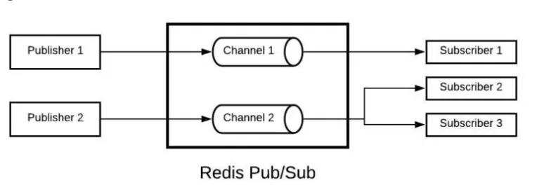
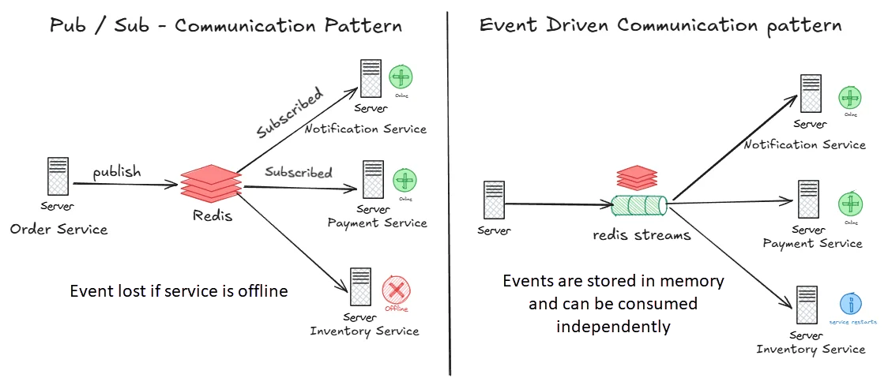

# Publish/Subscribe (Pub/Sub)

Redis Pub/Sub enables real-time messaging between applications. It decouples producers from consumers — a publisher does not need to know who (or how many) subscribers exist, and subscribers do not need to know which client published a message.

## Core Concepts

Before diving into commands, here are the key terms used throughout Redis Pub/Sub:

| Term        | Meaning                                                                                     |
|-------------|---------------------------------------------------------------------------------------------|
| Channel     | A named message conduit. Publishers send to a channel; subscribers listen on a channel.     |
| Publisher   | A client that sends messages to a channel (via `PUBLISH`).                                  |
| Subscriber  | A client that receives messages from a channel (via `SUBSCRIBE`).                           |
| Message     | The payload delivered from a publisher to subscriber(s).                                    |
| Pattern     | A glob-style wildcard used to subscribe to multiple channels at once (e.g., `news.*`).      |

## How Message Delivery Works

When a message is published to a channel, Redis delivers it to:

1. Every client subscribed to that **exact channel** (via `SUBSCRIBE`).
2. Every client whose **pattern subscription** matches the channel name (via `PSUBSCRIBE`).

`PUBLISH` returns an integer — the total number of clients that received the message (both exact and pattern subscribers combined).

If no clients are subscribed, the message is silently discarded.

## Commands

### Basic Pub/Sub

| Command                            | Description                          | Example                                |
|------------------------------------|--------------------------------------|----------------------------------------|
| `SUBSCRIBE channel [channel ...]`  | Listen for messages on one or more channels | `SUBSCRIBE news alerts`         |
| `UNSUBSCRIBE [channel ...]`        | Stop listening on channel(s)         | `UNSUBSCRIBE news`                     |
| `PUBLISH channel message`          | Send a message to a channel          | `PUBLISH news "Hello!"`                |

`SUBSCRIBE` is a **blocking call** — the client enters subscription mode and cannot run other commands until it unsubscribes.

### Pattern Pub/Sub

| Command                              | Description                                          | Example              |
|--------------------------------------|------------------------------------------------------|----------------------|
| `PSUBSCRIBE pattern [pattern ...]`   | Listen on all channels matching a glob pattern       | `PSUBSCRIBE news.*`  |
| `PUNSUBSCRIBE [pattern ...]`         | Stop listening on pattern(s)                         | `PUNSUBSCRIBE news.*`|

Patterns use glob-style wildcards: `*` matches any string, `?` matches a single character, and `[...]` matches a character class. For example, `PSUBSCRIBE news.*` subscribes to `news.sports`, `news.tech`, `news.weather`, and any other channel starting with `news.`.

### Shard Pub/Sub (Cluster Mode)

In a Redis Cluster, standard `PUBLISH` broadcasts the message to **every node** in the cluster, regardless of which node the subscriber is connected to. This works but does not scale well as the cluster grows.

Shard channels solve this. A shard channel is tied to a specific hash slot, so the message stays local to the node that owns that slot — no cluster-wide broadcast.

| Command                                        | Description                         | Example                          |
|------------------------------------------------|-------------------------------------|----------------------------------|
| `SSUBSCRIBE shardchannel [shardchannel ...]`   | Subscribe to shard-level channel(s) | `SSUBSCRIBE orders.123`          |
| `SUNSUBSCRIBE [shardchannel ...]`              | Unsubscribe from shard channel(s)   | `SUNSUBSCRIBE orders.123`        |
| `SPUBLISH shardchannel message`                | Publish to a shard-level channel    | `SPUBLISH orders.123 "shipped"`  |

Shard channels do **not** support pattern matching — only exact channel subscriptions work with `SSUBSCRIBE`.

### Introspection (`PUBSUB` Subcommands)

These subcommands inspect the current state of the Pub/Sub system without subscribing or publishing:

| Subcommand                          | Description                                                  | Example                      |
|-------------------------------------|--------------------------------------------------------------|------------------------------|
| `PUBSUB CHANNELS [pattern]`         | List active channels (optionally filtered by a glob pattern) | `PUBSUB CHANNELS news.*`     |
| `PUBSUB NUMSUB [channel ...]`       | Return the subscriber count for the given channels           | `PUBSUB NUMSUB news alerts`  |
| `PUBSUB NUMPAT`                     | Return the total number of active pattern subscriptions      | `PUBSUB NUMPAT`              |
| `PUBSUB SHARDCHANNELS [pattern]`    | List active shard channels (optionally filtered)             | `PUBSUB SHARDCHANNELS`       |
| `PUBSUB SHARDNUMSUB [channel ...]`  | Return the subscriber count for shard channels               | `PUBSUB SHARDNUMSUB orders.123` |

## Step-by-Step Example

Open three separate terminal windows and run `redis-cli` in each to start three independent sessions.

**Step 1:** In the first two terminals, subscribe to the `news` channel:

    > SUBSCRIBE news

Each client enters subscription mode and waits for messages.

**Step 2:** In the third terminal, publish a message:

    > PUBLISH news "Breaking News: Redis 7.0 Released!"
    (integer) 2

Both subscribers immediately receive the message. The return value `2` indicates two clients received it.

**Step 3:** In the third terminal, check active channels and subscriber counts:

    > PUBSUB CHANNELS
    1) "news"

    > PUBSUB NUMSUB news
    1) "news"
    2) (integer) 2

## Keyspace Notifications

In standard Pub/Sub, a client application calls `PUBLISH` to send messages. Keyspace notifications are different — **Redis itself** is the publisher. Whenever a key is created, modified, deleted, or expired, Redis automatically publishes an event to a special channel. Clients can subscribe to these channels to react to data changes without polling.

### Enabling Notifications

Keyspace notifications are disabled by default because they consume CPU. Enable them by setting the `notify-keyspace-events` configuration option. The value is a string of flags that controls which event types Redis publishes:

| Flag | Category                                                         |
|------|------------------------------------------------------------------|
| `K`  | Enable `__keyspace@<db>__` channel (key-name based)              |
| `E`  | Enable `__keyevent@<db>__` channel (event-type based)            |
| `g`  | Generic commands: `DEL`, `EXPIRE`, `RENAME`, ...                 |
| `$`  | String commands: `SET`, `APPEND`, `INCR`, ...                    |
| `l`  | List commands: `LPUSH`, `RPOP`, `BLPOP`, ...                     |
| `s`  | Set commands: `SADD`, `SREM`, `SPOP`, ...                        |
| `h`  | Hash commands: `HSET`, `HDEL`, ...                               |
| `z`  | Sorted set commands: `ZADD`, `ZREM`, ...                         |
| `x`  | Expiration events (key reached its TTL)                          |
| `e`  | Eviction events (key evicted due to `maxmemory` policy)          |
| `A`  | Alias for `g$lshzxe` — all event types                           |

At least one of `K` or `E` must be present, otherwise no notifications are delivered. For example, to receive all event types on both channel formats:

    > CONFIG SET notify-keyspace-events KEA

To persist this across restarts, add it to `redis.conf`:

    notify-keyspace-events "KEA"

### Channel Formats

When notifications are enabled, Redis publishes each event to two channels simultaneously:

**Keyspace channel** — indexed by key name, the message body is the operation that occurred:

    __keyspace@<db>__:<key>

**Keyevent channel** — indexed by event type, the message body is the key that was affected:

    __keyevent@<db>__:<event>

For example, running `DEL mykey` on database 0 produces:

    PUBLISH __keyspace@0__:mykey del
    PUBLISH __keyevent@0__:del mykey

Use keyspace channels when you care about all operations on a specific key. Use keyevent channels when you care about a specific operation across all keys.

### Example

**Terminal 1** — subscribe to all keyspace events on database 0 using a pattern:

    > PSUBSCRIBE __keyspace@0__:*

**Terminal 2** — perform some operations:

    > SET user:1 "Alice"
    > DEL user:1

Terminal 1 receives:

    1) "pmessage"
    2) "__keyspace@0__:*"
    3) "__keyspace@0__:user:1"
    4) "set"

    1) "pmessage"
    2) "__keyspace@0__:*"
    3) "__keyspace@0__:user:1"
    4) "del"

To listen for expiration events specifically (e.g., for cache invalidation), subscribe to the keyevent channel for `expired`:

    > SUBSCRIBE __keyevent@0__:expired

Any key that expires in database 0 will trigger a message on this channel with the expired key name as the payload.

## Pub/Sub vs. Streams

Redis Pub/Sub does not buffer or persist messages. If a publisher sends a message to a channel with no active subscribers, the message is lost — no backlog or history is stored. Messages are delivered only to subscribers connected at the moment of publishing.

This makes Pub/Sub well-suited for event notifications, real-time feeds, and inter-service communication where occasional message loss is acceptable. For use cases that require message retention or replay, use Redis Streams instead (covered in [Data Types — Stream](02_redis_data_types.md#stream)).

The diagram above compares the two approaches. On the left, an Order Service publishes an event via Pub/Sub. The Notification Service and Payment Service are online and receive it immediately, but the Inventory Service is offline — its message is lost with no way to recover it. On the right, the same event is appended to a Redis Stream. Unlike Pub/Sub, Streams **retain messages in memory** with unique IDs, so consumers can read them at any time. When the Inventory Service restarts, it picks up where it left off and processes the events it missed. Messages remain in the stream until explicitly trimmed or deleted.
