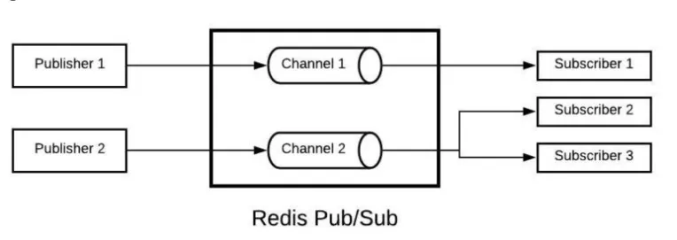
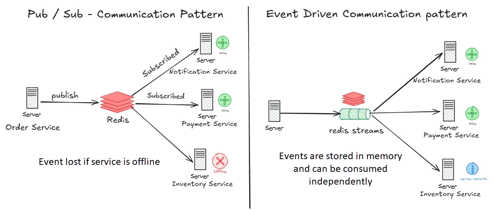

# Publish/Subscribe (Pub/Sub)

Redis Pub/Sub enables real-time messaging between applications. Think of it like a radio broadcast: a radio station (publisher) transmits on a frequency (channel), and anyone tuned to that frequency (subscriber) hears the broadcast. The station does not need to know who is listening, and listeners do not need to know anything about the station — they just tune in to the channel they care about.

This decoupling makes Pub/Sub ideal for event notifications, real-time feeds, chat systems, and inter-service communication.

## Core Concepts

Before diving into commands, here are the key terms used throughout Redis Pub/Sub:

| Term        | Meaning                                                                                     |
|-------------|---------------------------------------------------------------------------------------------|
| Channel     | A named message conduit. Publishers send to a channel; subscribers listen on a channel.     |
| Publisher   | A client that sends messages to a channel (via `PUBLISH`).                                  |
| Subscriber  | A client that receives messages from a channel (via `SUBSCRIBE`).                           |
| Message     | The payload delivered from a publisher to subscriber(s).                                    |
| Pattern     | A glob-style wildcard used to subscribe to multiple channels at once (e.g., `news.*`).      |

## How Message Delivery Works

When a message is published to a channel, Redis delivers it to:

1. Every client subscribed to that **exact channel** (via `SUBSCRIBE`).
2. Every client whose **pattern subscription** matches the channel name (via `PSUBSCRIBE`).

`PUBLISH` returns an integer — the total number of clients that received the message (both exact and pattern subscribers combined). If no clients are subscribed, the return value is `0` and the message is silently discarded. Redis does **not** buffer or store undelivered messages — there is no backlog or history.

## Commands

### Basic Pub/Sub

| Command                            | Description                                  | Example                        |
|------------------------------------|----------------------------------------------|--------------------------------|
| `SUBSCRIBE channel [channel ...]`  | Listen for messages on one or more channels  | `SUBSCRIBE news alerts`        |
| `UNSUBSCRIBE [channel ...]`        | Stop listening on channel(s)                 | `UNSUBSCRIBE news`             |
| `PUBLISH channel message`          | Send a message to a channel                  | `PUBLISH news "Hello!"`        |

> **Important:** `SUBSCRIBE` is a **blocking call**. Once a client subscribes, it enters *subscription mode* and can only run `SUBSCRIBE`, `UNSUBSCRIBE`, `PSUBSCRIBE`, `PUNSUBSCRIBE`, and `PING`. All other commands are rejected until the client fully unsubscribes. This is why publishers and subscribers are typically separate `redis-cli` sessions (or separate application connections).

### Pattern Pub/Sub

Pattern subscriptions let you listen on multiple channels using a single command, without knowing the exact channel names in advance.

| Command                              | Description                                          | Example              |
|--------------------------------------|------------------------------------------------------|----------------------|
| `PSUBSCRIBE pattern [pattern ...]`   | Listen on all channels matching a glob pattern       | `PSUBSCRIBE news.*`  |
| `PUNSUBSCRIBE [pattern ...]`         | Stop listening on pattern(s)                         | `PUNSUBSCRIBE news.*`|

Patterns use **glob-style wildcards** (the same syntax used by shell commands like `ls *.txt`):

| Wildcard | Meaning                            | Example                                                       |
|----------|------------------------------------|---------------------------------------------------------------|
| `*`      | Matches any sequence of characters | `news.*` matches `news.sports`, `news.tech`, `news.weather`   |
| `?`      | Matches exactly one character      | `news.?` matches `news.a`, `news.b` but not `news.ab`        |
| `[...]`  | Matches one character from a set   | `news.[st]*` matches `news.sports`, `news.tech`               |

### Introspection (`PUBSUB` Subcommands)

These subcommands let you inspect the current state of the Pub/Sub system without subscribing or publishing. They are useful for monitoring and debugging.

| Subcommand                          | Description                                                  | Example                      |
|-------------------------------------|--------------------------------------------------------------|------------------------------|
| `PUBSUB CHANNELS [pattern]`         | List active channels (optionally filtered by a glob pattern) | `PUBSUB CHANNELS news.*`     |
| `PUBSUB NUMSUB [channel ...]`       | Return the subscriber count for the given channels           | `PUBSUB NUMSUB news alerts`  |
| `PUBSUB NUMPAT`                     | Return the total number of active pattern subscriptions      | `PUBSUB NUMPAT`              |
| `PUBSUB SHARDCHANNELS [pattern]`    | List active shard channels (optionally filtered)             | `PUBSUB SHARDCHANNELS`       |
| `PUBSUB SHARDNUMSUB [channel ...]`  | Return the subscriber count for shard channels               | `PUBSUB SHARDNUMSUB orders.123` |

## Step-by-Step Example

This example demonstrates basic Pub/Sub by using three separate `redis-cli` sessions — two subscribers and one publisher.

**Step 1 — Subscribe.** Open two terminal windows and run `redis-cli` in each. In both terminals, subscribe to the `news` channel:

    > SUBSCRIBE news

Each client enters subscription mode and waits for messages. You will see output similar to:

    1) "subscribe"
    2) "news"
    3) (integer) 1

The `(integer) 1` indicates this client is now subscribed to one channel.

**Step 2 — Publish.** Open a third terminal, start `redis-cli`, and publish a message:

    > PUBLISH news "Breaking News: Redis 7.0 Released!"
    (integer) 2

The return value `2` means two clients received the message.

**Step 3 — Observe.** Switch back to either subscriber terminal. You will see:

    1) "message"
    2) "news"
    3) "Breaking News: Redis 7.0 Released!"

**Step 4 — Inspect.** Back in the publisher terminal, check active channels and subscriber counts:

    > PUBSUB CHANNELS
    1) "news"

    > PUBSUB NUMSUB news
    1) "news"
    2) (integer) 2

## Shard Pub/Sub (Cluster Mode)

> **Prerequisite:** This section assumes familiarity with Redis Cluster. If you are not using a cluster, you can skip this section.

In a Redis Cluster, standard `PUBLISH` broadcasts the message to **every node** in the cluster, regardless of which node the subscriber is connected to. This works but does not scale well as the cluster grows.

Shard channels solve this. A shard channel is tied to a specific **hash slot** (the mechanism Redis Cluster uses to distribute keys across nodes), so the message stays local to the node that owns that slot — no cluster-wide broadcast.

| Command                                        | Description                         | Example                          |
|------------------------------------------------|-------------------------------------|----------------------------------|
| `SSUBSCRIBE shardchannel [shardchannel ...]`   | Subscribe to shard-level channel(s) | `SSUBSCRIBE orders.123`          |
| `SUNSUBSCRIBE [shardchannel ...]`              | Unsubscribe from shard channel(s)   | `SUNSUBSCRIBE orders.123`        |
| `SPUBLISH shardchannel message`                | Publish to a shard-level channel    | `SPUBLISH orders.123 "shipped"`  |

Shard channels do **not** support pattern matching — only exact channel subscriptions work with `SSUBSCRIBE`.

## Keyspace Notifications

In standard Pub/Sub, your application code calls `PUBLISH` to send messages. Keyspace notifications are different — **Redis itself** is the publisher. Whenever a key is created, modified, deleted, or expired, Redis automatically publishes an event to a special channel. Clients can subscribe to these channels to react to data changes without polling.

### Enabling Notifications

Keyspace notifications are **disabled by default** because they consume additional CPU. Enable them by setting the `notify-keyspace-events` configuration option. The value is a string of flags that controls which event types Redis publishes:

| Flag | Category                                                         |
|------|------------------------------------------------------------------|
| `K`  | Enable `__keyspace@<db>__` channel (key-name based)              |
| `E`  | Enable `__keyevent@<db>__` channel (event-type based)            |
| `g`  | Generic commands: `DEL`, `EXPIRE`, `RENAME`, ...                 |
| `$`  | String commands: `SET`, `APPEND`, `INCR`, ...                    |
| `l`  | List commands: `LPUSH`, `RPOP`, `BLPOP`, ...                     |
| `s`  | Set commands: `SADD`, `SREM`, `SPOP`, ...                        |
| `h`  | Hash commands: `HSET`, `HDEL`, ...                               |
| `z`  | Sorted set commands: `ZADD`, `ZREM`, ...                         |
| `x`  | Expiration events (key reached its TTL)                          |
| `e`  | Eviction events (key evicted due to `maxmemory` policy)          |
| `A`  | Alias for `g$lshzxe` — all event types                           |

At least one of `K` or `E` **must** be present, otherwise no notifications are delivered. For example, to receive all event types on both channel formats:

    > CONFIG SET notify-keyspace-events KEA

To persist this across restarts, add it to `redis.conf`:

    notify-keyspace-events "KEA"

### Channel Formats

When notifications are enabled, Redis publishes each event to two channels simultaneously:

**Keyspace channel** — indexed by key name. The message body is the operation that occurred:

    __keyspace@<db>__:<key>

**Keyevent channel** — indexed by event type. The message body is the key that was affected:

    __keyevent@<db>__:<event>

For example, running `DEL mykey` on database 0 causes Redis to internally publish:

    PUBLISH __keyspace@0__:mykey del
    PUBLISH __keyevent@0__:del mykey

Use **keyspace** channels when you care about all operations on a specific key (e.g., "notify me whenever `user:1` changes"). Use **keyevent** channels when you care about a specific operation across all keys (e.g., "notify me whenever any key is deleted").

### Example

**Terminal 1** — enable all keyspace notifications and subscribe to all keyspace events on database 0:

    > CONFIG SET notify-keyspace-events KEA
    OK
    > PSUBSCRIBE __keyspace@0__:*

**Terminal 2** — perform some operations:

    > SET user:1 "Alice"
    > DEL user:1

Terminal 1 receives two events:

    1) "pmessage"
    2) "__keyspace@0__:*"
    3) "__keyspace@0__:user:1"
    4) "set"

    1) "pmessage"
    2) "__keyspace@0__:*"
    3) "__keyspace@0__:user:1"
    4) "del"

**Listening for expiration events** — a common use case is cache invalidation. Subscribe to the keyevent channel for `expired` to be notified whenever a key's TTL runs out:

    > SUBSCRIBE __keyevent@0__:expired

Any key that expires in database 0 will trigger a message on this channel with the expired key name as the payload.

## Pub/Sub vs. Streams

Redis Pub/Sub is a fire-and-forget system. Messages are delivered only to subscribers connected at the moment of publishing. If no subscribers are online, the message is permanently lost.

This makes Pub/Sub well-suited for scenarios where occasional message loss is acceptable — event notifications, real-time dashboards, and chat. For use cases that require message retention, replay, or consumer groups, use Redis Streams instead (covered in [Data Types — Stream](02_redis_data_types.md#stream)).

The diagram above compares the two approaches. On the left, an Order Service publishes an event via Pub/Sub. The Notification Service and Payment Service are online and receive it immediately, but the Inventory Service is offline — its message is lost with no way to recover it. On the right, the same event is appended to a Redis Stream. Streams **retain messages in memory** with unique IDs, so consumers can read them at any time. When the Inventory Service restarts, it picks up where it left off and processes the events it missed. Messages remain in the stream until explicitly trimmed or deleted.
