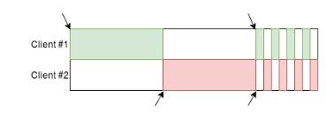

# Redis Pipelining

## The Round-Trip Problem

By default, a Redis client sends one command at a time, waits for the server's response, then sends the next command. Each command requires a full network round-trip:

    Client: SET key1 "value1"   →   Server
    Client:                     ←   OK
    Client: SET key2 "value2"   →   Server
    Client:                     ←   OK
    Client: GET key1            →   Server
    Client:                     ←   "value1"

For a single command, the latency is negligible. But when issuing hundreds or thousands of commands, the cumulative round-trip time (RTT) becomes the bottleneck — not the server's processing speed.

## What Pipelining Does

Pipelining allows the client to send multiple commands to Redis without waiting for each individual reply. The commands are buffered and sent in a single network write. The server processes them in order and sends all replies back, which the client reads in one batch:

    Client: SET key1 "value1"   →
            SET key2 "value2"   →   Server (processes all three)
            GET key1            →
    Client:                     ←   OK, OK, "value1"

This eliminates the idle time spent waiting for replies between commands. The improvement is proportional to the network latency — the higher the RTT, the greater the benefit.

## Using Pipelining with redis-cli

The `redis-cli` tool supports pipelining via `--pipe` mode. It reads commands from standard input and sends them in bulk:

    $ printf "SET key1 value1\r\nSET key2 value2\r\nGET key1\r\n" | redis-cli --pipe

    All data transferred. Waiting for the last reply...
    Last reply received from server.
    errors: 0, replies: 3

You can also pipe commands from a file:

    $ cat commands.txt
    SET user:1 "Alice"
    SET user:2 "Bob"
    INCR counter
    INCR counter

    $ cat commands.txt | redis-cli --pipe

## What Pipelining Does NOT Provide

Pipelining is a **network optimization only**. It does not provide:

- **Atomicity** — Other clients can execute commands between your pipelined commands. There is no guarantee that your batch runs without interruption.
- **Isolation** — Results of one command in the pipeline are not available to subsequent commands in the same pipeline (each command is independent).
- **Rollback** — If one command fails, the others still execute.

For example, if two clients both pipeline commands at the same time, the server may interleave them:

    Client A sends: SET x 1, SET y 2
    Client B sends: SET x 99

    Actual execution order might be: SET x 1, SET x 99, SET y 2

The diagram below illustrates this. Each row is a client, and the colored blocks represent commands being processed by the server over time. Notice how commands from Client #1 (green) and Client #2 (red) alternate — the server does not wait for one client's batch to finish before processing the other's:

## When to Use Pipelining

- **Bulk data loading** — Inserting thousands of records at startup or during migration.
- **Batch reads** — Fetching many keys at once when the results are independent.
- **Fire-and-forget writes** — Logging, metrics, or counters where individual failures are tolerable.
- **Any sequence of independent commands** — If command B does not depend on the result of command A, they can be pipelined.

If you need commands to execute as an uninterrupted unit, or when commands depend on each other (e.g., read a value, then decide what to write), use [Transactions](09_redis_transaction.md) instead.
