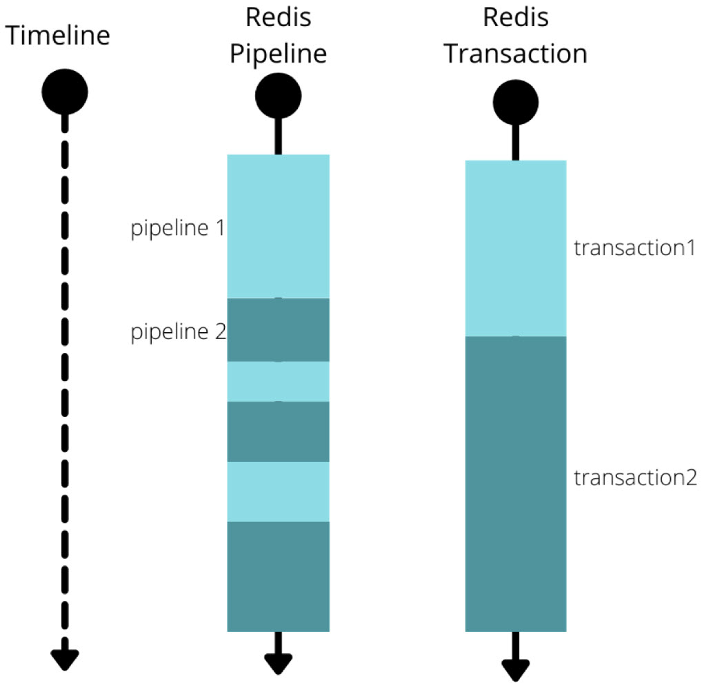

# Redis Transactions

Redis transactions allow executing a group of commands sequentially and atomically. No other client's commands are interleaved during execution.

| Command   | Description                                                                 |
|-----------|-----------------------------------------------------------------------------|
| `MULTI`   | Marks the start of a transaction. Subsequent commands are queued.           |
| `EXEC`    | Executes all queued commands and returns their results.                     |
| `DISCARD` | Cancels the transaction and clears the command queue.                       |
| `WATCH`   | Monitors one or more keys for changes before `EXEC` (optimistic locking).   |
| `UNWATCH` | Cancels all watched keys.                                                   |

## Basic Usage

```
> MULTI
OK
> SET key1 "value1"
QUEUED
> SET key2 "value2"
QUEUED
> INCR counter
QUEUED
> EXEC
1) OK
2) OK
3) (integer) 1
```

After `MULTI`, every command returns `QUEUED` instead of executing immediately. `EXEC` triggers execution and returns the results in order.

## Error Handling

Redis distinguishes between two types of errors in a transaction:

**Queue-time errors** (e.g., wrong number of arguments or invalid command name) are detected immediately. If any command fails to queue, `EXEC` refuses to run the transaction entirely.

```
> MULTI
OK
> SET key1
(error) ERR wrong number of arguments for 'set' command
> SET key2 "value2"
QUEUED
> EXEC
(error) EXECABORT Transaction discarded because of previous errors.
```

**Runtime errors** (e.g., applying a command to the wrong data type) are only discovered during execution. Redis does **not** roll back the other commands — successful commands still take effect.

```
> SET key1 "hello"
OK
> MULTI
OK
> INCR key1
QUEUED
> SET key2 "value2"
QUEUED
> EXEC
1) (error) ERR value is not an integer or out of range
2) OK
```

Here `SET key2` succeeds even though `INCR key1` failed. This differs from relational databases where a failed statement rolls back the entire transaction.

## Optimistic Locking with WATCH

`WATCH` monitors one or more keys before starting a transaction. If any watched key is modified by another client between `WATCH` and `EXEC`, the transaction is aborted (`EXEC` returns `nil`). This provides optimistic locking without holding any locks.

**Example — Preventing Counter Overwrites**

```
WATCH counter
MULTI
INCR counter
EXEC
```

If another client modifies `counter` after `WATCH` but before `EXEC`, the transaction is aborted and `EXEC` returns `nil`. The client can then retry.

**Example — Safe Balance Deduction**

Scenario: deducting money from an account without race conditions.

```
WATCH balance
balance = GET balance
IF balance >= 100
    MULTI
    DECRBY balance 100
    EXEC                 # Returns nil if balance was modified by another client
ELSE
    UNWATCH              # Release the watch when not proceeding
    PRINT "Insufficient funds"
```

If `EXEC` returns `nil`, the client retries the entire sequence from `WATCH`. Use `UNWATCH` to release watched keys when a transaction is no longer needed.

## Pipelining vs. Transactions

[Pipelining](08_redis_pipelining.md) and transactions both involve sending multiple commands, but they serve different purposes:

| Aspect       | Pipelining                              | Transactions (MULTI/EXEC)                  |
|--------------|-----------------------------------------|--------------------------------------------|
| Purpose      | Reduce network round-trips              | Execute commands atomically                |
| Atomicity    | No — other clients can interleave       | Yes — no interleaving during EXEC          |
| Performance  | Faster (fewer round-trips)              | Slightly slower (MULTI/EXEC overhead)      |
| Combination  | Can be combined for both benefits       | Can be combined for both benefits          |

The diagram below illustrates the difference. On the left, two pipelines share the server timeline and their commands interleave (alternating light and dark blocks). On the right, each transaction runs as a contiguous block — transaction 1 completes entirely before transaction 2 begins:



In practice, you often want both: pipeline the `MULTI`, commands, and `EXEC` together to get atomicity *and* reduced round-trips. Client libraries typically do this automatically (see [Python Client](14_redis_client_python.md) for examples).
