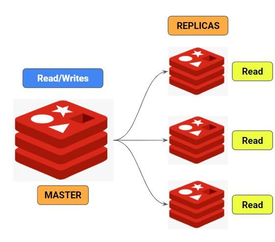
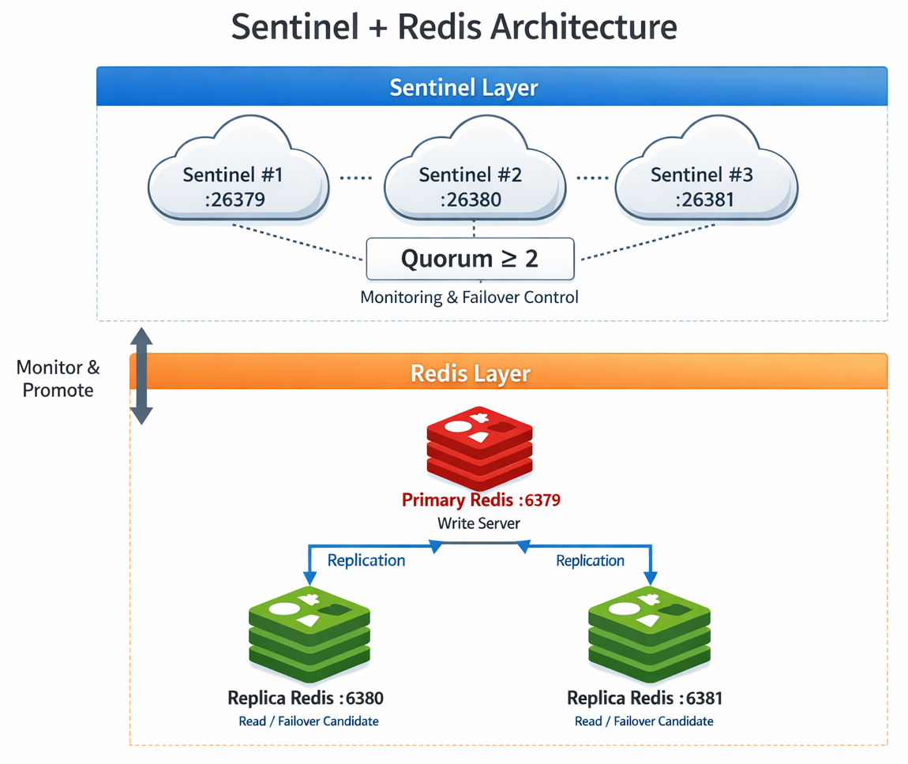
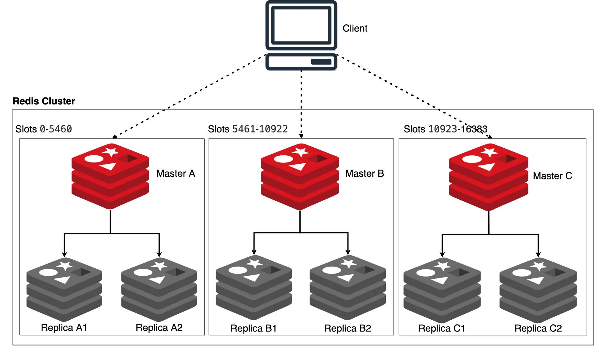

# Replication & Clustering

## What Is Replication?

Redis replication creates copies of a Redis server's data on one or more additional servers. The original server is called the **master** (or primary), and the copies are called **replicas** (or secondaries).

Replication provides:

- **High availability:** If the master goes down, a replica can take over.
- **Read scalability:** Read-heavy workloads can be distributed across replicas.
- **Data redundancy:** Multiple copies of data protect against hardware failures.

Replication in Redis is **asynchronous** by default — the master does not wait for replicas to confirm writes before responding to the client.

## How Replication Works

When a replica connects to a master for the first time, a **full synchronization** occurs:

1. The replica sends a `PSYNC` command to the master.
2. The master starts a background save (`BGSAVE`) to produce an RDB snapshot and buffers all new write commands received during the save.
3. Once the snapshot is complete, the master sends the RDB file to the replica.
4. The replica loads the RDB file into memory, replacing any existing data.
5. The master then sends the buffered write commands to bring the replica up to date.
6. From this point on, the master streams every write command to the replica in real time.

If a replica briefly disconnects and reconnects, Redis uses **partial resynchronization** via `PSYNC`. The master maintains a **replication backlog** (an in-memory buffer of recent writes). When the replica reconnects, the master sends only the missed commands from this backlog, avoiding the cost of a full resync. A full resynchronization is triggered only when the backlog is insufficient to cover the gap.

## Setting Up a Replica

To make a Redis instance a replica of another, use the `REPLICAOF` command:

    > REPLICAOF <master-ip> <master-port>

For example, to replicate from a master running on `192.168.1.100:6379`:

    > REPLICAOF 192.168.1.100 6379

The replica will initiate synchronization with the master as described above.

To promote a replica back to a standalone master:

    > REPLICAOF NO ONE

### Configuration File Method

Replication can also be configured persistently in `redis.conf`:

    replicaof 192.168.1.100 6379

If the master requires authentication:

    masterauth <master-password>

## Read-Only Replicas

By default, replicas are read-only. Clients connected to a replica can run read commands (`GET`, `HGETALL`, etc.) but cannot execute write commands.

This is controlled by the configuration directive:

    replica-read-only yes

Keeping replicas read-only is recommended to maintain data consistency across the replication topology.

## Checking Replication Status

Use the `ROLE` command to check the current role of a Redis instance.

On the master:

    > ROLE
    1) "master"
    2) (integer) 12345           # replication offset
    3) 1) 1) "192.168.1.101"     # connected replica IP
          2) "6379"              # connected replica port
          3) "12345"             # replica's replication offset

On a replica:

    > ROLE
    1) "slave"                   # role (protocol still uses "slave")
    2) "192.168.1.100"           # master IP
    3) (integer) 6379            # master port
    4) "connected"               # link status
    5) (integer) 12345           # replication offset

For detailed replication metrics (role, connected replicas, replication offset, backlog status, and sync state):

    > INFO replication

## Replication Command Reference

| Command       | Description                                                                 |
|---------------|-----------------------------------------------------------------------------|
| `REPLICAOF`   | Configure the current instance as a replica of another server, or promote it with `REPLICAOF NO ONE`. |
| `SLAVEOF`     | Deprecated alias for `REPLICAOF`.                                           |
| `ROLE`        | Return the replication role of the instance (master, replica, or sentinel).  |
| `PSYNC`       | Partial resynchronization with the master (used internally by replicas).     |
| `SYNC`        | Full synchronization with the master (legacy protocol, replaced by `PSYNC`). |

## Redis Sentinel (High Availability)

Redis Sentinel is a supervisory process that monitors your Redis data nodes. It ships with the Redis distribution and runs as the same `redis-server` binary started in Sentinel mode (`redis-server --sentinel`) or via the `redis-sentinel` alias. Sentinel runs as its own independent process with a dedicated configuration file (`sentinel.conf`) — it is **not** embedded in your master or replica instances.

You deploy multiple Sentinel processes (at least three, typically on separate machines) to form a monitoring and decision-making layer above your Redis data nodes.

Key capabilities:

- **Monitoring:** Continuously pings master and replica instances to verify they are reachable and operating correctly.
- **Automatic failover:** If a majority of Sentinels agree that a master is unreachable (forming a **quorum**), they elect a leader Sentinel that promotes a replica to master and reconfigures the remaining replicas to follow the new master.
- **Configuration provider:** Clients connect to Sentinel first to discover the current master address. After a failover, clients query Sentinel again and are transparently redirected to the new master.
- **Notification:** Publishes events (via Pub/Sub) when instances change state, enabling alerting and automation.

The quorum requirement prevents false positives — a single Sentinel experiencing a network partition cannot trigger a failover on its own.

## Redis Cluster (Horizontal Scaling)

While replication copies data for redundancy, **Redis Cluster** distributes data across multiple master nodes for horizontal scaling.

The key space is divided into **16,384 hash slots**. Each master node owns a subset of these slots. When a client writes or reads a key, Redis hashes the key to determine which slot (and therefore which node) owns it. Each master can have its own replicas for high availability within the cluster.

| Command                | Description                                      |
|------------------------|--------------------------------------------------|
| `CLUSTER INFO`         | Display cluster state and statistics.            |
| `CLUSTER NODES`        | List all nodes and their roles in the cluster.   |
| `CLUSTER SLOTS`        | Show the mapping of hash slots to nodes.         |
| `CLUSTER MEET ip port` | Introduce a new node to the cluster.             |
| `CLUSTER REPLICATE id` | Make the current node a replica of another node. |

Key differences from standalone Redis:

- Data is automatically sharded across nodes.
- Only database 0 is supported (multiple databases are not available).
- Multi-key commands require all affected keys to reside in the **same hash slot**. Use **hash tags** (e.g., `{user}.name` and `{user}.email`) to co-locate related keys.

For more details, see [Redis Enterprise Cluster Architecture](https://redis.io/technology/redis-enterprise-cluster-architecture/).
